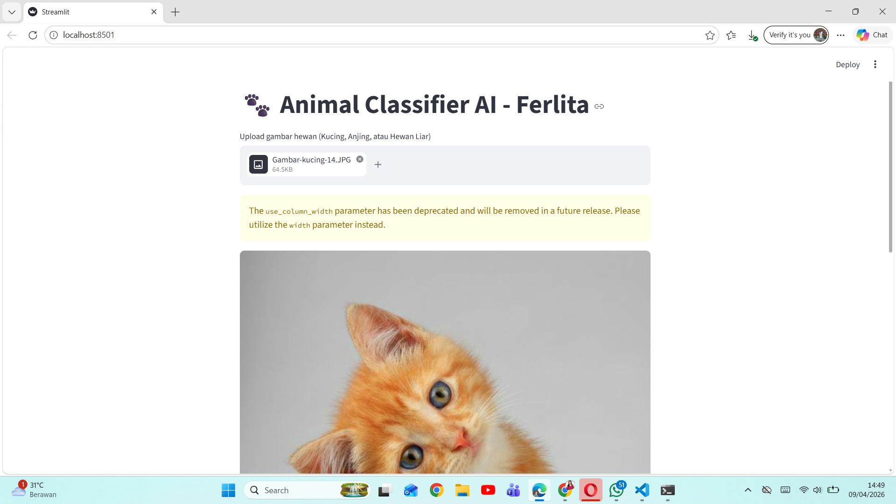

UTS Kecerdasan Buatan - Klasifikasi Gambar Hewan 🐾
Proyek ini dibuat untuk memenuhi tugas UTS mata kuliah Kecerdasan Buatan. Model AI ini mampu mengklasifikasikan gambar menjadi tiga kategori: Kucing, Anjing, dan Hewan Liar.
Nama: Ferlita Kristiani Hulu
NIM: 241712025
Prodi: Teknik Informatika 

1. Fitur Utama
Model CNN Optimal: Mengatasi overfitting menggunakan teknik Dropout dan Data Augmentation.
Good Fit: Selisih akurasi training dan validasi sangat rendah dan stabil.
Web Interface: Aplikasi web interaktif berbasis Streamlit untuk prediksi gambar secara real-time.

2. 📊 Hasil Analisis Model
Model awal mengalami overfitting yang parah. Setelah dilakukan optimasi, model mencapai kondisi Good Fit.

3. gambar Grafik
Sesudah Optimasi (Good Fit) |
 |


4. 💻 Tampilan Aplikasi Web
Aplikasi ini dijalankan menggunakan Streamlit. Berikut adalah tampilan saat melakukan prediksi:



5. Cara Menjalankan Secara Lokal
1. Pastikan sudah menginstal library yang dibutuhkan:
   ```bash
   pip install streamlit torch torchvision pillow
